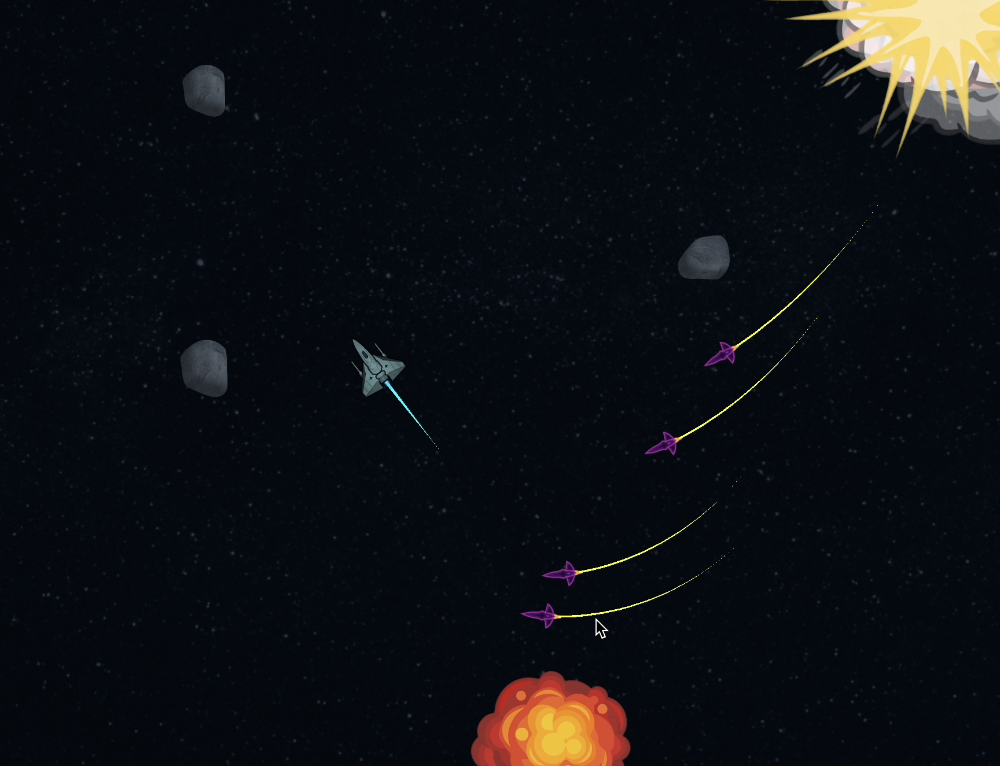

# Aptos Star Fighter

An Aptos space survival game

Escape the rockets and try to survive as long as possible!
Your best score will be saved on-chain for everyone to see!

## Screenshot:

## Requirements

In order to play a native build of the game, you need a wallet that supports IC anonymous pairings.
Make sure you're using Petra Mobile with version >= 1.1.2.
For the WebGL build, no specific version is required.

## Project structure

The repository is subdivided into three main folders:
- [move](move): The smart contract that manages the game state and the high score.
- [server](server): The server that handles authentication and talks to the blockchain.
- [game](game): The game client, which is a Unity 3D project design to build for native desktop, as well as WebGL. In the game folder, the README [there](https://github.com/aptos-labs/star-fighter/blob/main/game/README.md) will also explain how we integrated Identity Connect with the dApp

On top of that, we have the `aptos-unity-webgl-template` which is a WebGL
template that supports the [Aptos Wallet Adapter](https://github.com/aptos-labs/aptos-wallet-adapter).

## Useful Links
- Link to deployed WebGL build: https://star-fighter.vercel.app
- Link to Mac OSX build: https://drive.google.com/file/d/1hzFMgBcvLby3548gAfeT4Nmsf37Yjuz5/view?usp=sharing

## Collaborators / special thanks:
- [Greg Nazario](https://github.com/gregnazario)
- [Bowen Yang](https://github.com/bowenyang007)
- Aleksey Popov
