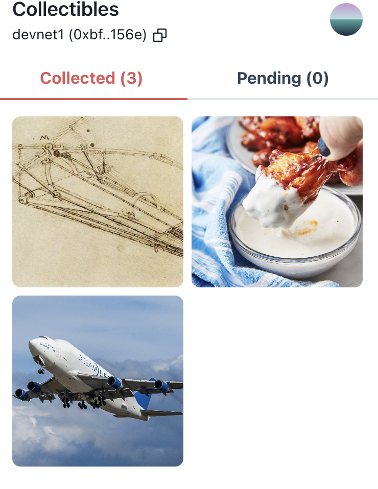
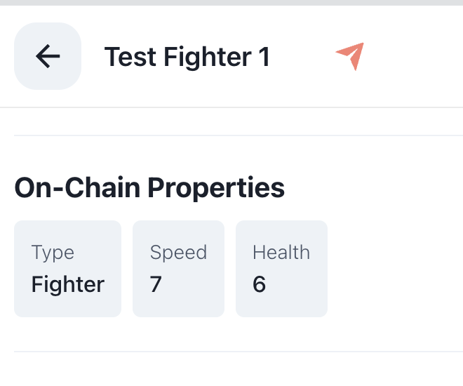
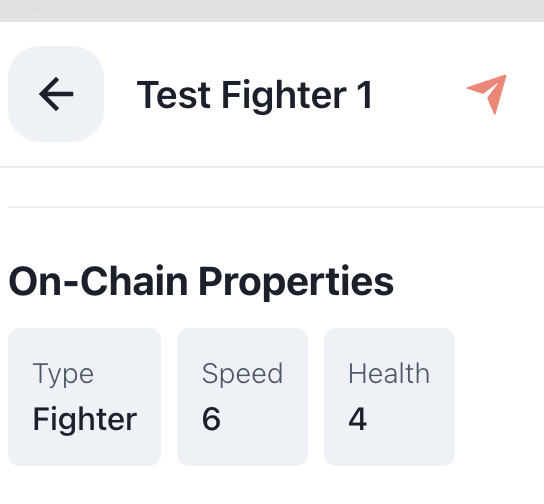
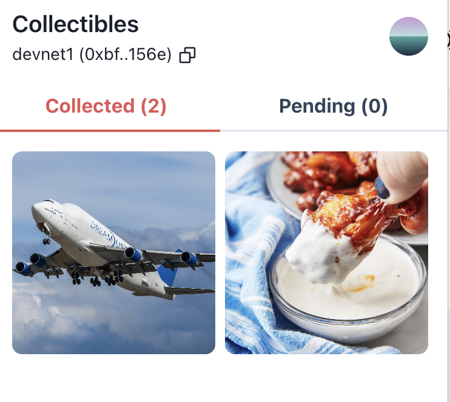

# The contract
* The contract has 3 parts: 
  * composable_nfts to handle the space fighter tokens and the parts
  * the soulbound pilot token to track achievement and provide a place for user to select an avatar and ANS
  * the account where each user will deposit APTs and the contract will sign the gameplay for them

# Deployment
```
# Create profile
aptos init --profile devnet
# Confirm that code compiles
aptos move compile --named-addresses space_fighters=devnet
# Deploy
yes | aptos move publish --named-addresses space_fighters=devnet --profile=devnet
```

# Testing
```
yes | aptos move run --function-id 0x72051a1da89698e7cf185d8e1e6a2c9a8835337d3d7015f97f054e2e4864d15a::composable_nfts::mint_fighter --args address:0xbfb4561cee3ff2d63dc7c314f7c6b36ffde3bb94cfd273b879c47c951600156e string:"Test Fighter 1" string:"This is a test fighter" string:"https://c02.purpledshub.com/uploads/sites/41/2023/05/747-Dreamlifter-474a5d1.jpg" u64:1 u64:1 --profile devnet

yes | aptos move run --function-id 0x72051a1da89698e7cf185d8e1e6a2c9a8835337d3d7015f97f054e2e4864d15a::composable_nfts::mint_wing --args address:0xbfb4561cee3ff2d63dc7c314f7c6b36ffde3bb94cfd273b879c47c951600156e string:"Test Wing 1" string:"This is a test wing" string:"https://hips.hearstapps.com/hmg-prod/images/classic-buffalo-wings-vertical-298-1547508036.jpg" u64:3 u64:1 --profile devnet

yes | aptos move run --function-id 0x72051a1da89698e7cf185d8e1e6a2c9a8835337d3d7015f97f054e2e4864d15a::composable_nfts::mint_body --args address:0xbfb4561cee3ff2d63dc7c314f7c6b36ffde3bb94cfd273b879c47c951600156e string:"Test Body 1" string:"This is a test body" string:"https://cdn.mos.cms.futurecdn.net/qev47tw2tAVScVwhjpvSsH-1200-80.jpg" u64:2 u64:5 --profile devnet

```
You'll get something like this


Then let's merge
```
yes | aptos move run --function-id 0x72051a1da89698e7cf185d8e1e6a2c9a8835337d3d7015f97f054e2e4864d15a::composable_nfts::swap_or_add_parts --args address:0xbfb4561cee3ff2d63dc7c314f7c6b36ffde3bb94cfd273b879c47c951600156e address:0xada01a1c4be7431f8058068b065df72ef984bbf82d8f73849d5fb5fad90928d0 'address:["0x37ebf83915a826dcc962663386f045a2aa090965beaa0c4f49214e2dcb59d31b"]' 'address:["0x4d34fedc24b40376652ff44a1f1379208b933a53a7e7ddd7272794c6f4acc5b4"]' --profile devnet
```


Now let's try swapping a different wing
```
yes | aptos move run --function-id 0x72051a1da89698e7cf185d8e1e6a2c9a8835337d3d7015f97f054e2e4864d15a::composable_nfts::mint_wing --args address:0xbfb4561cee3ff2d63dc7c314f7c6b36ffde3bb94cfd273b879c47c951600156e string:"Test Wing 2" string:"This is a test wing, super weak" string:"https://steamcdn-a.akamaihd.net/apps/440/icons/sf14_purity_wings_large.5266a77263fa624dbab9660e88788508f7ade05a.png" u64:1 u64:0 --profile devnet
yes | aptos move run --function-id 0x72051a1da89698e7cf185d8e1e6a2c9a8835337d3d7015f97f054e2e4864d15a::composable_nfts::swap_or_add_parts --args address:0xbfb4561cee3ff2d63dc7c314f7c6b36ffde3bb94cfd273b879c47c951600156e address:0xada01a1c4be7431f8058068b065df72ef984bbf82d8f73849d5fb5fad90928d0 'address:["0xc6201bd27ee8c5bc5669c96f911773c7924c4f8ca316e6b5567e302c6ed14a4d"]' 'address:[]' --profile devnet
```

This wing is weaker, so we see that the fighter got weaker as well

